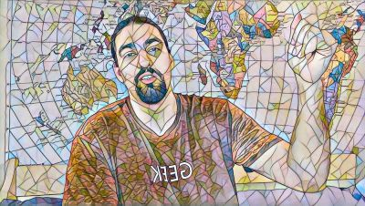
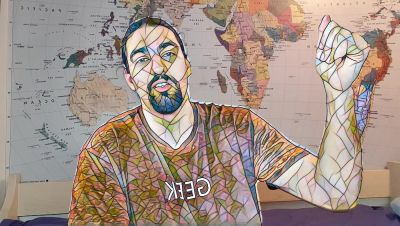
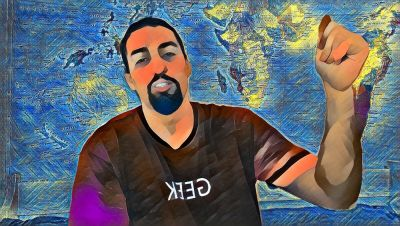
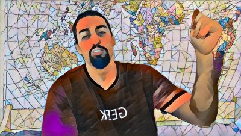
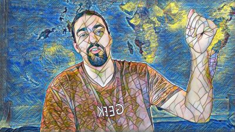
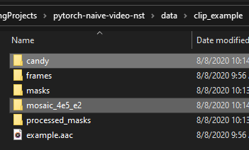

## Naive Video - Fast NST :movie_camera: + :zap::computer: + :art: = :heart:
This repo is a wrapper around [my implementation of fast NST](https://github.com/gordicaleksa/pytorch-nst-feedforward) (for static images) and it additionally provides:
1. Support for creating (naive - no temporal loss included) videos
2. Support for creating segmentation masks for the person talking

You **just place your videos in data/ directory** and **you get stylized/segmented videos** - easy as that. <br/>

It's an accompanying repo for [this video series on YouTube](https://www.youtube.com/watch?v=S78LQebx6jo&list=PLBoQnSflObcmbfshq9oNs41vODgXG-608).

<p align="left">
<a href="https://www.youtube.com/watch?v=S78LQebx6jo" target="_blank"></a>
</p>

The first video of the series was created exactly using this method (I also used ReCoNet for 1 part of the video).

## Combining stylized frames with original frames (via seg masks)

On the left you can see typical NST output and the 2 other images on the right were created using masks.

<p align="center">



</p>

They were created using this segmentation mask (and original frame as the overlay):

<p align="left">

</p>

It's not perfect but it was created in a **fully automatic** fashion. <br/>

*Note: I intentionally show-cased a non-perfect segmentation mask here to display some problems I had (part of the world map behind me had a skin-like color).*

## Combining 2 types of stylized frames (via seg masks)

Similarly instead of using the original frame as the overlay you can use some other style:

<p align="center">



</p>

## Setup

1. `git clone --recurse-submodules https://github.com/gordicaleksa/pytorch-naive-video-nst`
2. `cd pytorch-naive-video-nst`
2. Run `conda env create` from project directory (this will create a brand new conda environment).
3. Run `activate pytorch-video-naive` (for running scripts from your console or set the interpreter in your IDE)
4. Run `resource_downloader.py` (from pytorch-nst-feedforward submodule) it will download 4 pretrained models
5. Make sure you have **ffmpeg** in your system path (used for creating videos)

That's it! It should work out-of-the-box executing environment.yml file which deals with dependencies.<br/>

*Note: There is 1 git submodule (fast NST project) in this repo. That's why you'll need `--recurse-submodules` <br/>
check out [this SO link](https://stackoverflow.com/questions/3796927/how-to-git-clone-including-submodules) if you run into any problems.*

-----

PyTorch package will pull some version of CUDA with it, but it is highly recommended that you install system-wide CUDA beforehand, mostly because of GPU drivers. I also recommend using Miniconda installer as a way to get conda on your system. 

Follow through points 1 and 2 of [this setup](https://github.com/Petlja/PSIML/blob/master/docs/MachineSetup.md) and use the most up-to-date versions of Miniconda and CUDA/cuDNN (I recommend CUDA 10.1 or 10.2 as those are compatible with PyTorch 1.5, which is used in this repo, and newest compatible cuDNN).

## Usage


After you're done with the setup you can just run this: `python naive_video_pipeline.py` <br/>
And it will create results for the default `example.mp4` video in `data/clip_example/` <br/>

To run the pipeline on your own videos do the following:
1. Place them under `data/`
2. Specify which ones you want to process via `--specific_videos` argument like: ['my_video1.mp4', my_video2.mp4'] <br/>

That's it! If you bump into `CUDA out of memory` errors check out the Debugging section **(easy to fix)**. <br/>

----

The output you can expect after processing `my_video.mp4` (which can be found in `data/clip_my_video/`):
1. `frames/` - dumped frames from your video
2. `masks/` and `processed_masks` - contain segmentation masks for the person in the video
3. `my_video.aac` - sound clip from your video
4. `<model_name>/` - contains stylized and combined imagery and videos **(this is what you want)**

<p align="left">

</p>

----

If you want to combine your videos with some other style instead of overlaying the original frame, <br/>
set the `--other_style` to the the name of the model whose frames you want to use as the overlay. <br/>
 
## Debugging
Q: I'm getting `CUDA out of memory` error in the segmentation/stylization stage what should I do?<br/>
A: 2 options: a) make the image width smaller b) make the batch size smaller

## Citation

If you find this code useful for your research, please cite the following:

```
@misc{Gordić2020-naive-video-nst,
  author = {Gordić, Aleksa},
  title = {pytorch-naive-video-nst},
  year = {2020},
  publisher = {GitHub},
  journal = {GitHub repository},
  howpublished = {\url{https://github.com/gordicaleksa/pytorch-naive-video-nst}},
}
```

## Connect with me

If you'd love to have some more AI-related content in your life :nerd_face:, consider:
* Subscribing to my YouTube channel [The AI Epiphany](https://www.youtube.com/c/TheAiEpiphany) :bell:
* Follow me on [LinkedIn](https://www.linkedin.com/in/aleksagordic/) and [Twitter](https://twitter.com/gordic_aleksa) :bulb:
* Follow me on [Medium](https://gordicaleksa.medium.com/) :books: :heart:

## Licence

[](https://github.com/gordicaleksa/pytorch-naive-video-nst/blob/master/LICENCE)